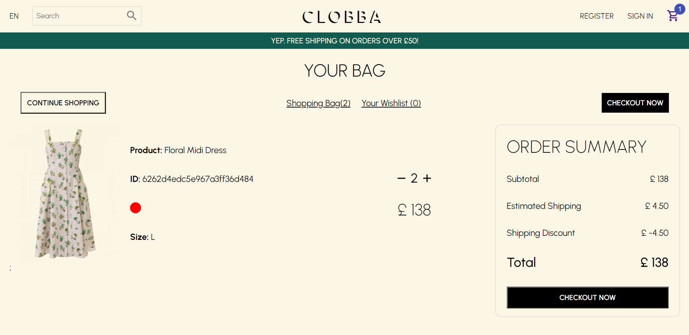
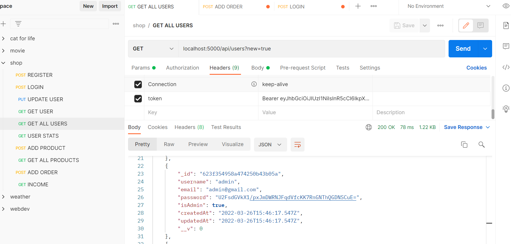
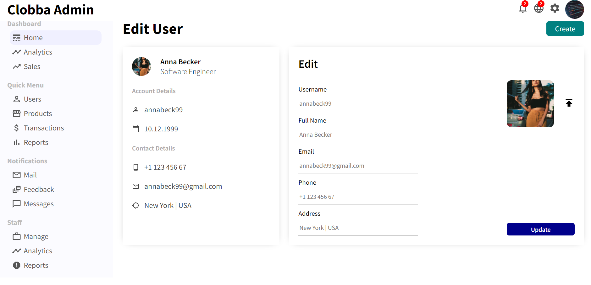
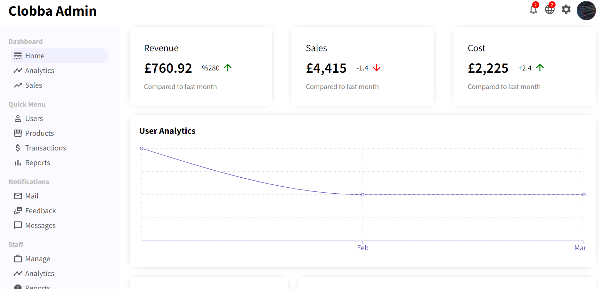

# 🚀 CLOBBA  🚀

Welcome to CLOBBA, Full-Stack MERN E-Commerce Web Application! 💻 🛍️

Visit the live site here: https://clobba.onrender.com/ 🌐

(Card Number: 4242424242424242. mm/yy: 12/34.  cvc: 567)

---

## CLIENT UI 🎨

design meets technology with some of our coolest features:

🎨 Fully Re-usable React Styled-Components

🎡 Pure JavaScript Slider Component

⚛️  Redux: state management for shopping cart updates 🛒

🔍 Product Categories: Find what you're looking for effortlessly - navigation made easy.

✨ Animations: elegant and smooth interactions

📱 Responsive Design: No matter the device, big or small, CLOBBA adapts!

---

##  Back end - REST API / Database / Auth / Payment. 💾

🔧 API Built with Express.JS and Node.JS

 

  

🍃 Mongoose for MongoDB object modeling.

📦 MongoDB as the database.

🔒 password hashing with Crypto.JS.

🔐 JSON Web Token (JWT) user verification. 

💳 STRIPE payment implementation.

🔥 Google Firebase used for image storage

---

📊 FULLY INTEGRATED ADMIN DASHBOARD (FOR ADMIN SIGNIN):

📉 Custom React charts 

🧑 Full User profiles and data: orders, products purchased, amount spent, user details, etc. 💼💸

💰 Calculates business revenue 💵💹

